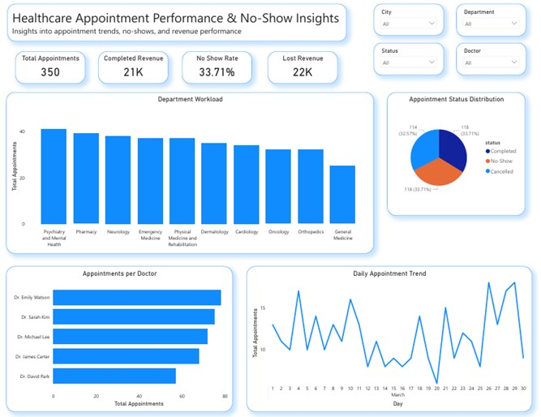

# 🏥 Patient Appointment & No-Show Analysis Dashboard

## 📌 Overview

This project analyzes healthcare appointment data to identify no-show patterns, revenue loss, and operational performance.

## 📊 Tools Used

* Power BI
* MySQL
* Excel

## 📈 Key Metrics

* Total Appointments
* No-Show Rate (%)
* Revenue Lost from No-Shows
* Completed Revenue

## 🔍 Key Insights

* Identified high no-show rates impacting revenue
* Highlighted busiest doctors and departments
* Revealed appointment trends over time

## 🎨 Dashboard Features

* KPI tiles for quick insights
* Interactive filters (doctor, city, department)
* Clean, minimalist layout
* Professional formatting and color consistency

## 📁 Files Included

* Dataset (CSV)
* Power BI Dashboard (.pbix)
* Dashboard Screenshot

## 🚀 Skills Demonstrated

* Data modeling
* DAX calculations
* Data visualization
* Business insight generation

## 📁 DASHBOARD PREVIEW

